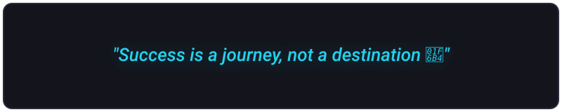

  

<h1 align="center">Hello, I’m Dhanush M! 👋 I’m excited to connect with you.</h1>

<h3 align="center">
  ☁️ Cloud Engineer | Full Stack Developer
    
  I build scalable cloud-based and full-stack applications with a strong focus on problem-solving, clean development, and practical system design. My experience spans AWS, Java, Python, React, Node.js, SQL, and MongoDB, supported by consistent coding practice and hands-on project development. I enjoy transforming complex problems into simple, reliable solutions and continuously expanding my skills to become a stronger software and cloud engineer.
</h3>

  

 

## 📡 Connect with me:

## 🛠 Languages and Tools:

<table>
  <tr>
    <td align="center"><b>PROGRAMMING LANGUAGE</b></td>
  </tr>
  <tr>
    <td align="center">
      
    </td>
  </tr>
  <tr>
    <td align="center"><b>Frontend</b></td>
  </tr>
  <tr>
    <td align="center">
      
    </td>
  </tr>
  <tr>
    <td align="center"><b>Backend and DataBases</b></td>
  </tr>
  <tr>
    <td align="center">
      
    </td>
  </tr>
  <tr>
    <td align="center"><b>Tools & UI/UX</b></td>
  </tr>
  <tr>
    <td align="center">
      
    </td>
  </tr>
</table>

## ✍️ QUOTES

  

---

  

